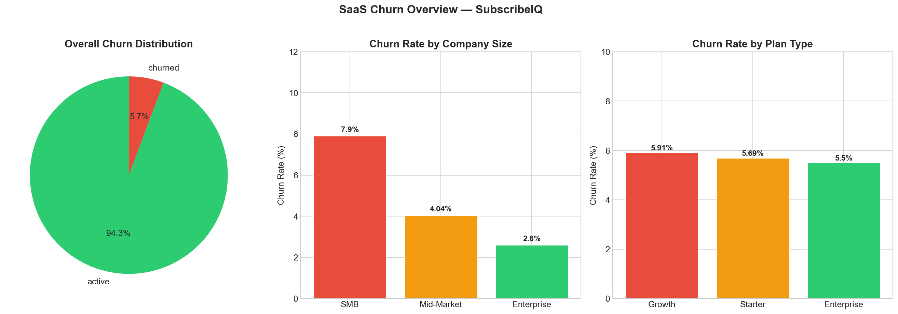
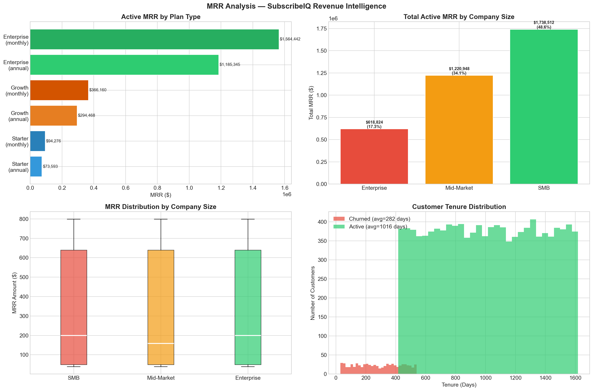
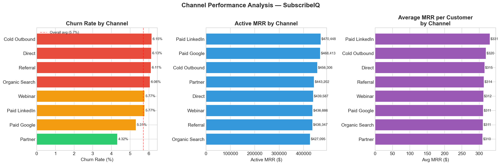
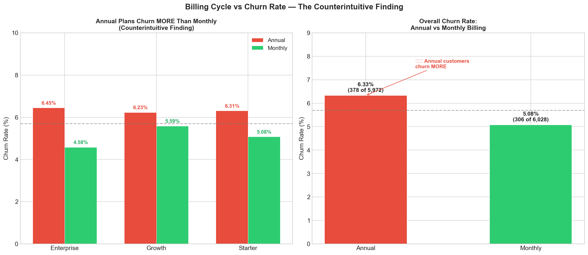
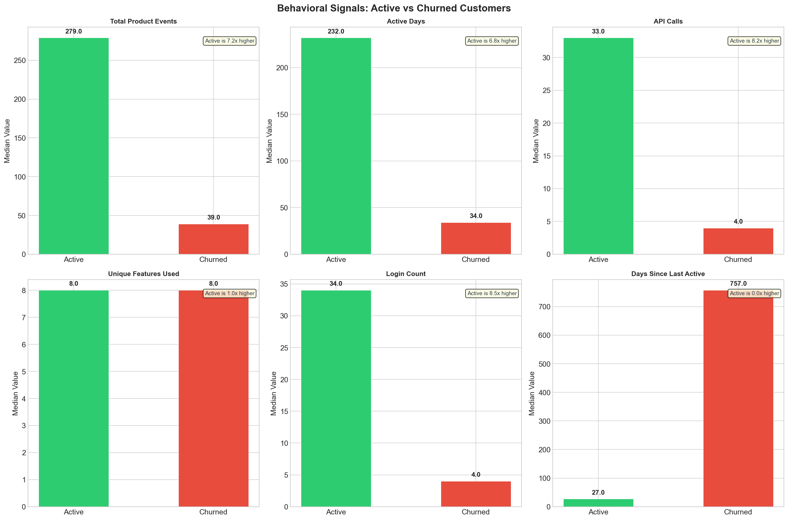
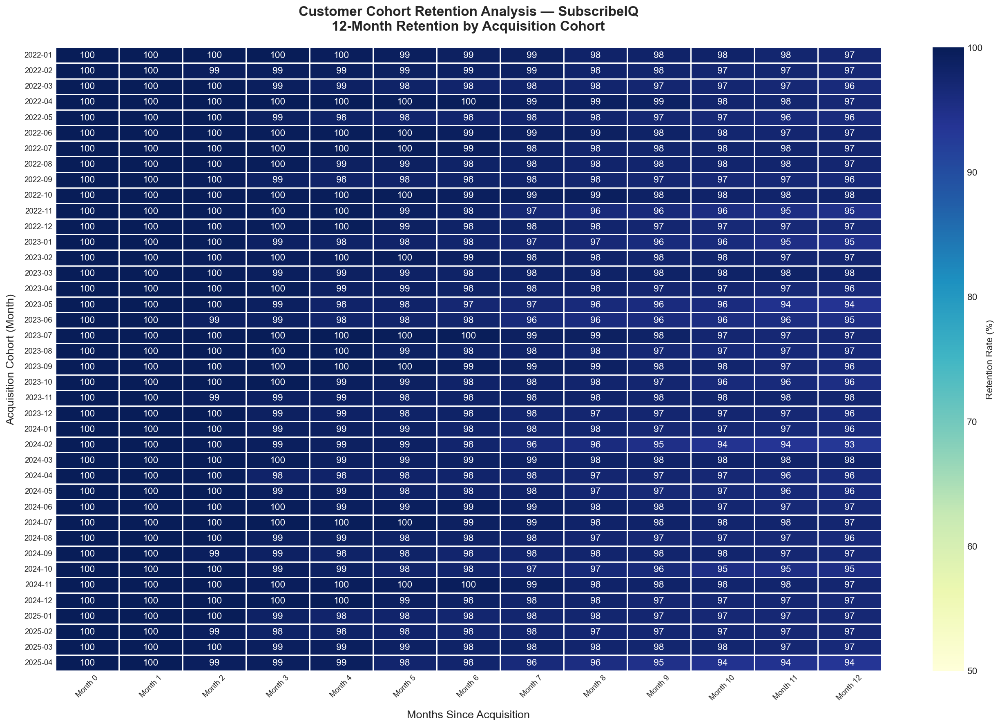
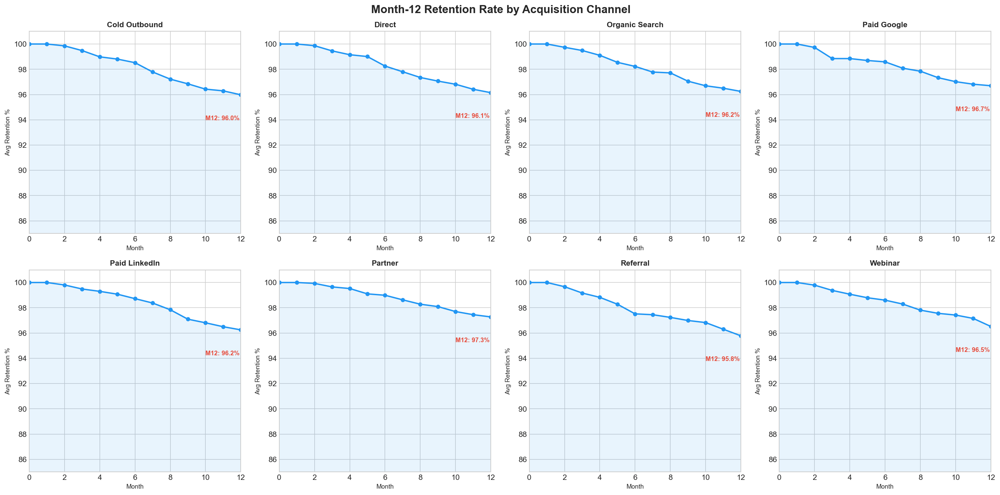
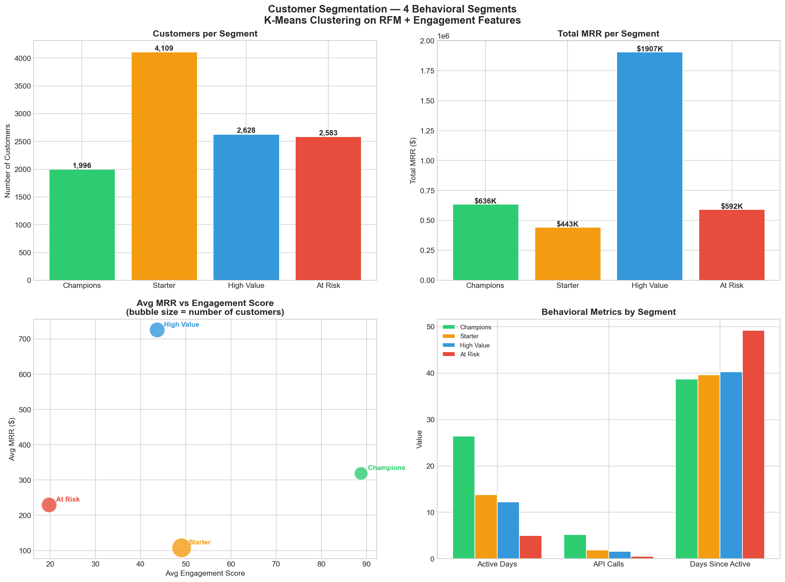
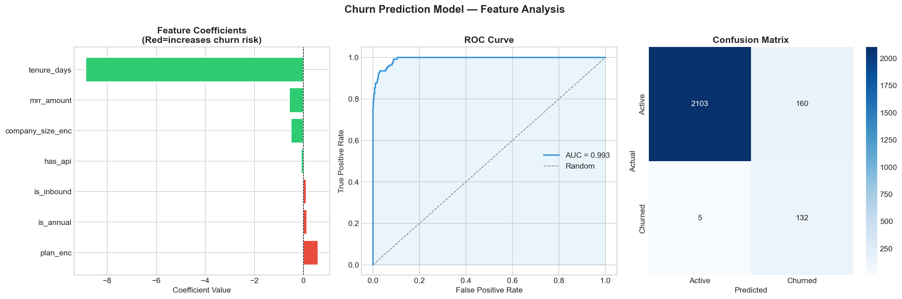

# SaaS Churn Analytics — Revenue Intelligence & Behavioral Early-Warning System


> End-to-end analytics project simulating real analyst work inside a B2B SaaS company — from schema design and data generation to behavioral health scoring, statistical validation, cohort analysis, customer segmentation, and churn prediction modeling.

---

## The Problem

Most churn analyses start with a cancellation event. By then, the intervention window is already shrinking.

This project investigates a different question:

**How early can behavioral disengagement be detected — and can it be quantified in revenue terms before it appears in financial reports?**

Working with a simulated B2B SaaS environment (SubscribeIQ — fictional), this project builds a full analytical stack: from raw event-level data to a prioritised, dollar-quantified account intervention list that a Customer Success team can act on the same day.

---

## Business Context

| Parameter | Value |
|---|---|
| Company | SubscribeIQ (simulated B2B SaaS) |
| Total Customers | 12,000 |
| Total ARR | $42.8 Million |
| Monthly Churn Rate | 5.7% (benchmark: 2–4%) |
| Net Revenue Retention | 94.5% (benchmark: >100%) |
| Product Events Analyzed | 3,113,813 |
| Analysis Period | Jan 2022 – Apr 2026 |

## Project Structure

```text
saas-churn-analytics/
├── src/
│   └── generate_data.py              # Synthetic data generation
├── sql/
│   ├── 01_churn_rate_analysis.sql    # Churn by segment, plan, industry
│   ├── 02_mrr_waterfall.sql          # MRR movements and NRR
│   ├── 03_customer_health_score.sql  # Behavioral health scoring
│   ├── 04_revenue_at_risk.sql        # Dollar-quantified risk
│   └── 05_channel_performance.sql    # Acquisition channel quality
├── notebooks/
│   ├── 01_eda.ipynb                  # EDA + behavioral analysis
│   ├── 02_cohort_analysis.ipynb      # 12-month cohort heatmap
│   ├── 03_segmentation.ipynb         # RFM + K-Means clustering
│   └── 04_churn_model.ipynb          # Logistic regression model
├── outputs/                          # All charts saved here
└── README.md
```
## Database Schema

Star schema with 6 tables in PostgreSQL 16.

| Table | Rows | Description |
|---|---|---|
| dim_customers | 12,000 | Customer profiles |
| dim_plans | 6 | Pricing plans |
| dim_channels | 8 | Acquisition channels |
| dim_dates | 1,581 | Date dimension |
| fact_subscriptions | 12,000 | Core subscription data |
| fact_events | 3,113,813 | Product usage events |

---

## Key Findings

### 1. Churn is a segmentation problem

| Segment | Churn Rate | Customers | ARR at Risk |
|---|---|---|---|
| SMB | 7.9% | 5,926 | $561K |
| Mid-Market | 4.04% | 4,035 | — |
| Enterprise | 2.6% | 2,039 | — |

SMB represents 68% of all churn while generating 48.6% of MRR. A 2% reduction in SMB churn recovers approximately $170K ARR annually.

---

### 2. Nearly half of ARR is behaviorally at risk

| Category | ARR | Share |
|---|---|---|
| Total ARR | $42.8M | 100% |
| Behaviorally at risk | $21.1M | 49% |
| Critical (health score < 40) | $11.2M | 26% |

This revenue has not churned yet. It still appears healthy in financial reports. Behavioral signals are the only early-warning system.

---

### 3. Annual billing masks product failure for up to 11 months

| Plan | Annual Churn | Monthly Churn | Delta |
|---|---|---|---|
| Enterprise | 6.45% | 4.58% | +1.87% |
| Growth | 6.23% | 5.59% | +0.64% |
| Starter | 6.31% | 5.08% | +1.23% |
| Overall | 6.33% | 5.08% | +1.25% |

Annual customers churn more across every plan tier. Hypothesis: customers commit during a sales cycle before experiencing product value — and disengage quietly for up to 11 months before non-renewal.

---

### 4. API adoption is the strongest retention predictor

| Signal | Active | Churned | Ratio | p-value |
|---|---|---|---|---|
| Login count | 34.0 | 4.0 | 8.5x | <0.001 |
| API calls | 33.0 | 4.0 | 8.2x | <0.001 |
| Active days | 232.0 | 34.0 | 6.8x | <0.001 |
| Total events | 279.0 | 39.0 | 7.2x | <0.001 |
| Unique features | 8.0 | 8.0 | 1.0x | <0.001 |

Notable: Churned customers explored the same number of features as active customers — they simply never used any of them deeply enough to form habits. The onboarding problem is not feature discovery. It is value realization depth.

---

### 5. Technical issues drive more churn than price

| Churn Reason | Count | Share |
|---|---|---|
| Technical issues | 85 | 12.4% |
| Missing features | 76 | 11.1% |
| Switched to competitor | 75 | 11.0% |
| Too expensive | 70 | 10.2% |
| No longer needed | 70 | 10.2% |

Most SaaS companies optimize for pricing flexibility. This data suggests product stability is the higher-leverage intervention.

---

### 6. Channel quality is a three-way tradeoff

| Channel | Churn Rate | Avg MRR | LTV |
|---|---|---|---|
| Partner | 4.32% | $310 | $2,433 |
| Paid Google | 5.31% | $311 | $2,561 |
| Paid LinkedIn | 5.77% | $331 | $3,237 |
| Cold Outbound | 6.15% | $320 | $3,282 |

No single channel wins on all three dimensions simultaneously.

---

### 7. Cohort retention is stable but has a critical window

- Average Month-12 retention across 40 cohorts: 96.4%
- Sharpest churn drop occurs at Month 2-4
- Best cohort (2024-03): 98.1% at Month 12
- Worst cohort (2024-02): 93.3% at Month 12
- Partner channel best Month-12 retention: 97.3%
- Referral channel worst Month-12 retention: 95.8%

---

### 8. High Value segment controls 53% of MRR at only 29% engagement

| Segment | Customers | Share | Total MRR | MRR Share | Avg Engagement |
|---|---|---|---|---|---|
| Champions | 1,996 | 17.6% | $636K | 17.8% | 88.8 |
| High Value | 2,628 | 23.2% | $1.9M | 53.3% | 43.7 |
| Starter | 4,109 | 36.3% | $443K | 12.4% | 49.1 |
| At Risk | 2,583 | 22.8% | $592K | 16.6% | 19.8 |

The High Value segment pays $726 avg MRR but logs in only 12 days per 90-day period. Half the company's revenue sits with customers who are not deeply engaged.

---

## Visualizations

### Churn Overview


### MRR Analysis


### Channel Performance


### Annual vs Monthly Churn


### Behavioral Signals: Active vs Churned


### Cohort Retention Heatmap


### Channel Cohort Retention Curves


### Customer Segmentation


### Churn Prediction Model


---

## Business Recommendations

| Priority | Recommendation | Impact |
|---|---|---|
| P0 | Weekly Revenue at Risk report — CS team acts on health score list | $21M protected |
| P1 | Automated low-touch re-engagement for SMB segment | ~$170K ARR saved |
| P1 | 90-day value realization program for annual plan customers | ~$196K ARR saved |
| P1 | Immediate CSM outreach for High Value segment (engagement < 40) | $1.9M MRR protected |
| P2 | Prioritize product stability over new features | Reduce churn 1–2% |
| P2 | Redesign onboarding to drive API activation within 14 days | Improve retention |
| P2 | Proactive CS outreach at Month 2-4 for all cohorts | Catch churn cliff early |
| P3 | Expand partner ecosystem — lowest churn channel at 4.32% | Improve NRR |

---

## How to Reproduce

```bash
# Clone
git clone https://github.com/VinayDera/saas-churn-analytics.git
cd saas-churn-analytics

# Setup
python -m venv venv
venv\Scripts\activate
pip install pandas numpy matplotlib seaborn scikit-learn sqlalchemy psycopg2-binary faker jupyter scipy

# Database
psql -U postgres -c "CREATE DATABASE saas_churn;"

# Generate data (~5 minutes)
python src/generate_data.py

# Run notebooks
jupyter notebook notebooks/
```

Expected output:

dim_dates         :    1,581 rows
dim_channels      :        8 rows
dim_plans         :        6 rows
dim_customers     :   12,000 rows
fact_subscriptions:   12,000 rows
fact_events       :3,113,813 rows

---

## Tech Stack

| Tool | Purpose |
|---|---|
| PostgreSQL 16 | Star schema database |
| Python 3.10 | Data generation and analysis |
| pandas | Data manipulation |
| matplotlib + seaborn | Visualizations |
| scikit-learn | K-Means clustering + logistic regression |
| scipy.stats | Statistical significance testing |
| Jupyter | Interactive analysis |
| GitHub | Version control |

---

## Project Status

- [x] Database schema and data generation (3.1M rows)
- [x] SQL analysis — 5 scripts
- [x] Python EDA — behavioral analysis and statistical tests
- [x] Cohort retention analysis — 40 cohorts x 12 months
- [x] Customer segmentation — RFM + K-Means (4 segments)
- [x] Churn prediction model — logistic regression
- [x] Visualizations — 10 charts

---

## Author

**Vinay Dera** — Junior Data Analyst

[LinkedIn](https://linkedin.com/in/dera-venkata-sai-vinay) · [GitHub](https://github.com/VinayDera) · vinaydera555@gmail.com
